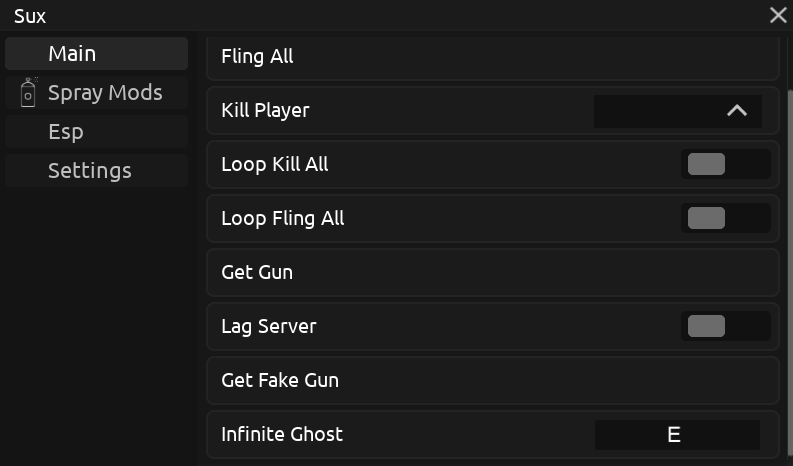
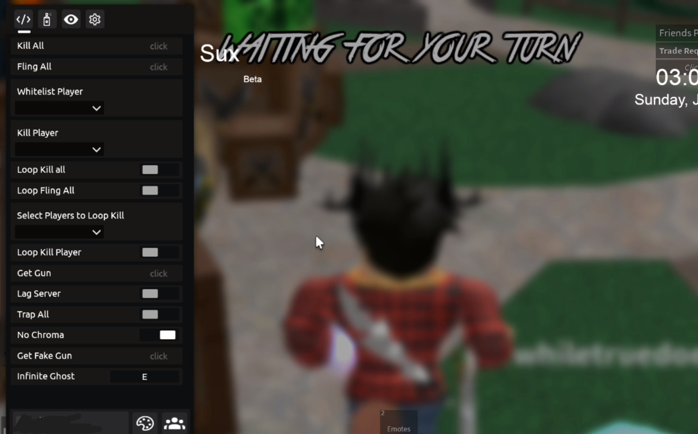
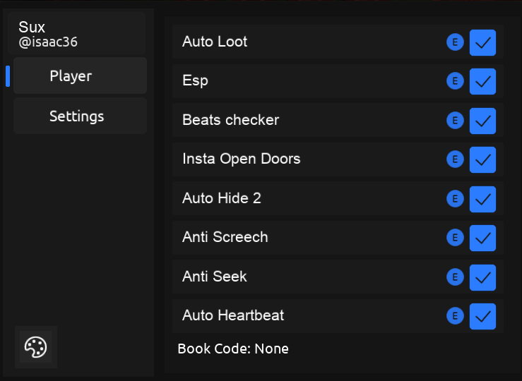
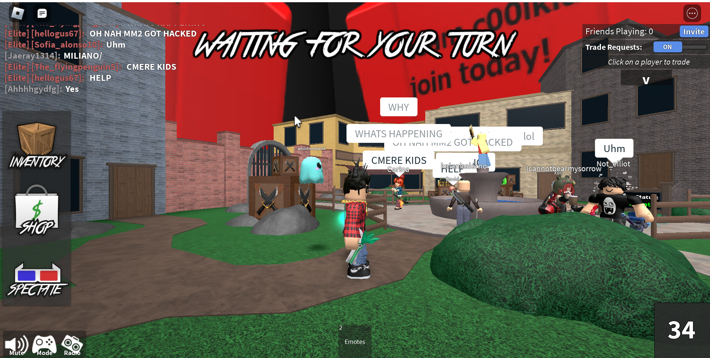

# Suxo

This repository serves as a showcase of scripts and UI libraries I created for games like 
- Da Hood 
- Tower of Hell
- Murder Mystery 2
- Doors
- Build a boat for a treasure
- Captive
- Breaking point

Three versions of UI libraries:

v1: Initial release.

  
  

  

v4: Introduced themes and configuration system.

  
  

  

v5: Added themes, configuration system, and keybinds system.
  
  
  

## **Epic moments**  

Change background MM2
  
  
  

  

### The project is no longer maintained, but it provides insight into the development process and the features I implemented at the time.
